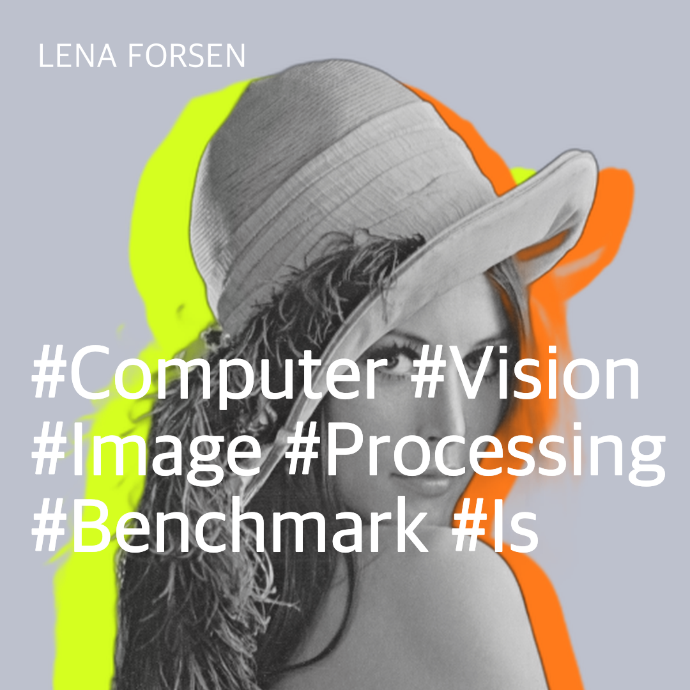

# Personal Branding Poster Generator

[English README](./README.md)

사용자가 인물 사진 1장과 PDF 이력서 1개를 업로드하면, 기술 키워드 기반 퍼스널 브랜딩 포스터를 생성하는 Python/FastAPI 프로젝트이자 Codex 스킬 저장소입니다.

## 주요 기능

- 인물 사진 업로드 검증 (`jpg`, `jpeg`, `png`)
- PDF 이력서 텍스트 추출 및 구조화
- 규칙 기반 요약/해시태그 생성
- 인물 배경 제거 (`rembg` 우선, OpenCV GrabCut 폴백)
- 흑백/저채도 인물 + 네온 실루엣 레이어 합성
- 정사각형 포스터 PNG 저장
- 메타데이터 JSON 저장
- FastAPI 업로드 API + CLI 실행 지원
- Codex 스킬 실행 지원

## 프로젝트 구조

```text
app/
  main.py
  models/
  routes/
  services/
agents/
scripts/
sample_inputs/
SKILL.md
tests/
requirements.txt
README.md
README.ko.md
```

`output/` 디렉터리는 실행 시 자동 생성됩니다.

## 설치

```bash
python3 -m venv .venv
source .venv/bin/activate
pip install -r requirements.txt
```

## CLI 실행

```bash
python -m app.main --image /path/to/photo.jpg --resume /path/to/resume.pdf --output-dir output
```

또는 저장소 루트 실행 스크립트를 사용하면 가상환경과 의존성을 자동 준비합니다.

```bash
python scripts/run_branding_poster.py --image /path/to/photo.jpg --resume /path/to/resume.pdf --output-dir output
```

생성 결과:

- `output/poster.png`
- `output/metadata.json`

## 샘플

샘플 입력 파일:

- 이미지: `sample_inputs/lenna_test_image.png`
- 이력서: `sample_inputs/lenna_resume_sample.pdf`
- 출력: `sample_output/lenna_poster_sample.png`

| input (+ resume.pdf) | output |
| -- | -- |
|  |  |

## API 실행

```bash
uvicorn app.main:app --reload
```

요청 예시:

```bash
curl -X POST "http://127.0.0.1:8000/poster/generate" \
  -F "photo=@/path/to/photo.jpg" \
  -F "resume_pdf=@/path/to/resume.pdf"
```

## Codex Skill 로 사용하기

이 저장소는 리포 자체가 스킬 번들입니다. GitHub에 올린 뒤 Codex에서 이 저장소를 설치하거나 열면 `SKILL.md`와 `agents/openai.yaml`을 통해 실행형 스킬로 사용할 수 있습니다.

예상 사용 흐름:

```text
$personal-branding-poster 이 사진과 이력서 PDF로 퍼스널 브랜딩 포스터 만들어줘
```

Codex는 저장소 안의 `scripts/run_branding_poster.py`를 실행해:

- 로컬 환경 준비
- 포스터 생성
- `poster.png`, `metadata.json` 반환

을 한 번에 처리할 수 있습니다.

## 구현 메모

- 해시태그/요약은 규칙 기반으로 작성되어 있어 이후 LLM 서비스로 교체하기 쉽도록 분리했습니다.
- `rembg`가 실패하거나 환경 이슈가 있을 경우 OpenCV GrabCut으로 폴백합니다.
- 텍스트는 흰색 대형 볼드 폰트로 자동 줄바꿈/축소되어 이미지 범위를 넘지 않도록 처리합니다.
