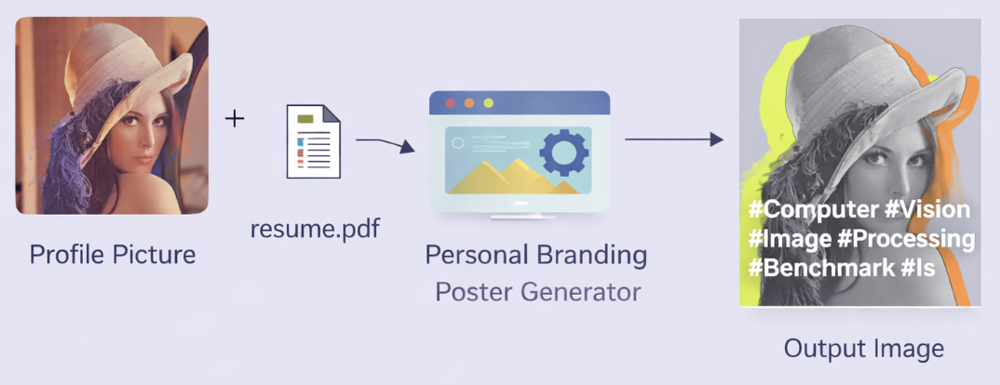

# Personal Branding Poster Generator

[한국어 README](./README.ko.md)

A Python/FastAPI project and Codex skill bundle that generates a personal branding poster from one portrait photo and one PDF resume.



## Features

- Validates portrait image uploads (`jpg`, `jpeg`, `png`)
- Extracts and structures text from PDF resumes
- Generates rule-based summaries and hashtags
- Removes image backgrounds with `rembg` and falls back to OpenCV GrabCut
- Composes a monochrome portrait with neon silhouette layers
- Saves square poster output as PNG
- Saves generated metadata as JSON
- Supports FastAPI, CLI, and Codex skill execution
- Includes a Gradio UI entrypoint for Hugging Face Spaces deployment

## Project Structure

```text
app/
  main.py
  models/
  routes/
  services/
agents/
scripts/
sample_inputs/
SKILL.md
tests/
requirements.txt
README.md
README.ko.md
```

The `output/` directory is created automatically during execution.

## Installation

```bash
python3 -m venv .venv
source .venv/bin/activate
pip install -r requirements.txt
```

## CLI Usage

```bash
python -m app.main --image /path/to/photo.jpg --resume /path/to/resume.pdf --output-dir output
```

You can also use the repository-level runner script, which prepares the virtual environment and dependencies automatically.

```bash
python scripts/run_branding_poster.py --image /path/to/photo.jpg --resume /path/to/resume.pdf --output-dir output
```

For the built-in sample demo:

```bash
python scripts/run_branding_poster.py --sample --output-dir output
```

Generated files:

- `output/poster.png`
- `output/metadata.json`

## API Usage

```bash
uvicorn app.main:app --reload
```

Example request:

```bash
curl -X POST "http://127.0.0.1:8000/poster/generate" \
  -F "photo=@/path/to/photo.jpg" \
  -F "resume_pdf=@/path/to/resume.pdf"
```

## Gradio UI

Run the Gradio app locally:

```bash
python gradio_app.py
```

The app reuses the same `BrandingPipeline` as the CLI and FastAPI route, and accepts:

- one portrait image (`jpg`, `jpeg`, `png`)
- one resume PDF (`pdf`)

It returns:

- generated poster preview
- extracted summary
- generated hashtags
- full metadata JSON

## Deploy To Hugging Face Spaces

This repository is now structured so it can be pushed directly to a Gradio Space. Hugging Face Spaces reads the YAML block at the top of `README.md` and launches [`gradio_app.py`](./gradio_app.py).

Typical flow:

```bash
git init
git remote add space https://huggingface.co/spaces/<your-account>/<your-space>
git add .
git commit -m "Add Gradio Space app"
git push space main
```

If you create the Space in the Hugging Face UI, choose the `Gradio` SDK and then push this repository contents.

## Tests

```bash
pytest
```

## Using It As a Codex Skill

This repository doubles as a Codex skill bundle. After publishing it to GitHub, Codex can install or open the repository and use `SKILL.md` plus `agents/openai.yaml` to run it as an execution-focused skill.

Example flow:

```text
$personal-branding-poster Create a personal branding poster from this portrait photo and resume PDF.
```

Sample flow:

```text
$personal-branding-poster Show me the sample result using the repository demo inputs.
```

Codex can run `scripts/run_branding_poster.py` to:

- prepare the local environment
- generate the poster
- return `poster.png` and `metadata.json`

## Example

Sample input files:

- Image: `sample_inputs/lenna_test_image.png`
- Resume: `sample_inputs/lenna_resume_sample.pdf`
- Output: `sample_output/lenna_poster_sample.png`

| input (+ resume.pdf) | output |
| -- | -- |
|  |  |

## Notes

- Summaries and hashtags are rule-based so the pipeline can be upgraded to an LLM-backed version later.
- If `rembg` fails or is unavailable, the code falls back to OpenCV GrabCut.
- The text overlay is auto-sized and wrapped to stay within the poster bounds.
